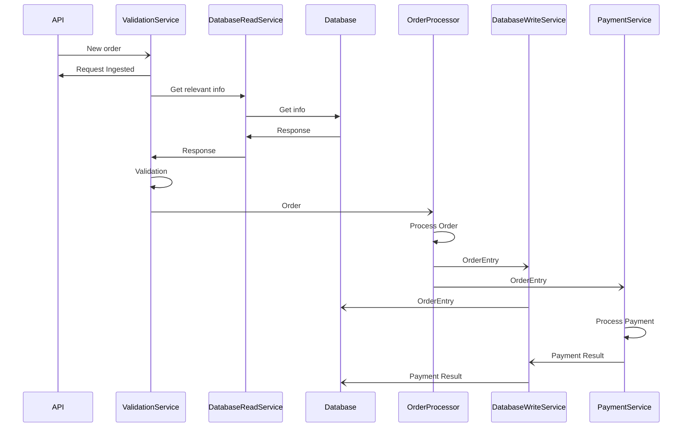
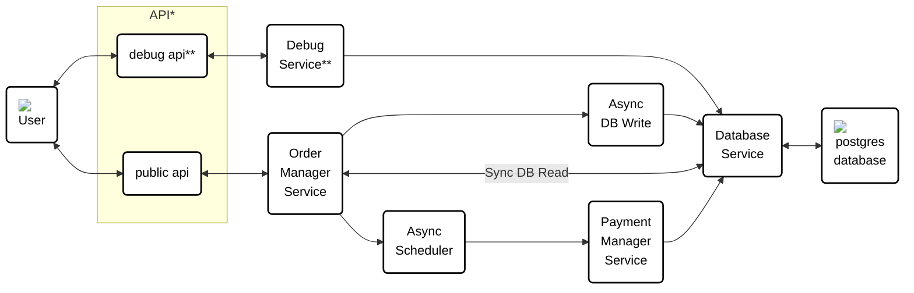
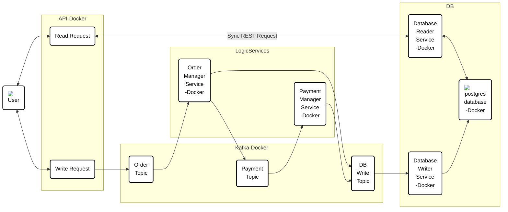

# Design work

> Note: The diagrams below will render in github, but they will be missing the icons. In order to render them in VS Code with the icons, install the `Markdown Preview Mermaid Support` extension

## General Approach
I generally like to start with requirements before picking technologies so that I can avoid unnecessarily coding myself into a corner. 

I also like to include debug checks that effectively bypass the order management service and go straight to the db via rest calls just to make it a bit easier to test. These will not have the level of testing I normally use because they are only here for the sake of testing as I develop and to make it easier for anyone reviewing this project to query the database directly. 

## Final Design

### Database Services
So, why the two services? In order to maximize the value of async, I didn't want my rest api to have to wait for database writes. I also wanted to avoid having both sync and async db interaction in the same service if it could be avoided. In a larger environment there would need to be proper monitoring as this has the potential downside of there being some really hard to track down bugs. In the past I have used DataDog to monitor these kinds of microservice chains to better hunt down any bugs. Additionally there should be a validate and lock step somewhere in the chain. Something like this:

Validation and DB read could be merged into one service potentially. Read from the DB once at the very start, lock the relevant elements, then write to it at the very end to unlock them. 

### Repeated Types
In a production environment I would suggest creating a shared types package that these microservices would import, ideally through a protocol buffer or similar serialized approach to save time and standardize. 

### Intent
I'm including an intent on all calls to make them easier to trace through the process. In a more fleshed out version of this solution, they could be used as part of the validation and locking step in the DB. 

## Iteration as I worked

### V0.0 

Before any code 

Initial thoughts: this feels like it could be overcomplicating things, so I am going to see how things go as I further develop.

\* Both debug and public APIs will be set up in the same location for now.  
\*\* The Debug API and Service exist only for the sake of the takehome. In a real life environment I would take steps to lock them down properly, but in order ot make it easier to grade I wanted an easy way to get info from the DB through rest calls

### V0.1: 

After reading Kafka docs

Thoughts: I'm going to pretend race conditions don't exist for the sake of this takehome. In a real environemnt there would be a hold put on any data that could be updated in one of the write reqeusts so that you couldn't do multiple modification requests and any read requests would get back an indicator that the data being read is partway through being changed. 

> The presense of - Docker indicates a docker container at that level

