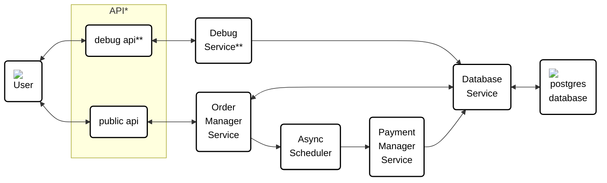

# Design work

> Note: The diagrams below will render in github, but they will be missing the icons. 

## General Approach
I generally like to start with requirements before picking technologies so that I can avoid unnecessarily coding myself into a corner. 

I also like to include debug checks that effectively bypass the order management service and go straight to the db via rest calls just to make it a bit easier to test. These will not have the level of testing I normally use because they are only here for the sake of testing as I develop and to make it easier for anyone reviewing this project to query the database directly. 

## Final Design

## Iteration as I worked
V0.0: Before any code

\* Both debug and public APIs will be set up in the same location for now.  
\*\* The Debug API and Service exist only for the sake of the takehome. In a real life environment I would take steps to lock them down properly, but in order ot make it easier to grade I wanted an easy way to get info from the DB through rest calls