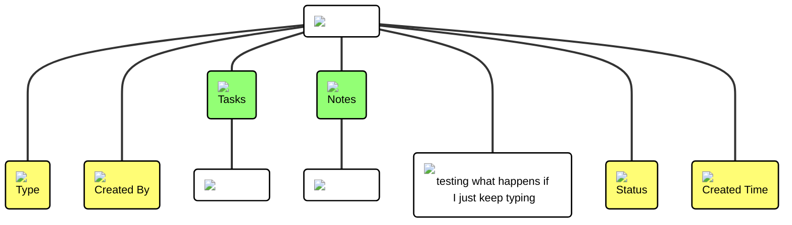

Shamelessly copied from https://redgregory.notion.site/Mermaid-Graph-Icons-cafb5c5b2f51473399a62c75501a3f33

More icons in https://super.so/icons 

```mermaid

flowchart TB

	%% Colors %%
		linkStyle default stroke-width:3px
		classDef white fill:white,stroke:#000,stroke-width:2px,color:#000
		classDef yellow fill:#fffd75,stroke:#000,stroke-width:2px,color:#000
		classDef green fill:#93ff75,stroke:#000,stroke-width:2px,color:#000
	
	%% Databases %%
		DOCS("<img src='https://super.so/icon/dark/file-minus.svg'; width='40' />"):::white
		NOTES("<img src='https://super.so/icon/dark/book.svg'; width='40' />"):::white
		TASKS("<img src='https://super.so/icon/dark/check-square.svg'; width='40' />"):::white
		DB("<img src='https://super.so/icon/dark/database.svg'; width='40' />testing what happens if\n I just keep typing"):::white

	%% Documents Database %%

		DOCS ---- DOCTYPE("<img src='https://super.so/icon/dark/chevron-down.svg'; width='25' /> Type"):::yellow
		DOCS ---- DOCCREATEDBY("<img src='https://super.so/icon/dark/user.svg'; width='25' /> Created By"):::yellow

			%% Documents to Tasks %%
	
				DOCS --- DOCTASKS("<img src='https://super.so/icon/dark/arrow-up-right.svg'; width='25' /> Tasks"):::green
				DOCTASKS --- TASKS

			%% Documents to Notes %%

				DOCS --- DOCNOTE("<img src='https://super.so/icon/dark/arrow-up-right.svg'; width='25' /> Notes"):::green
				DOCNOTE --- NOTES

      %% Documents to DB%%
      DOCS ---- DB

		DOCS ---- DOCSTATUS("<img src='https://super.so/icon/dark/chevron-down.svg'; width='25' /> Status"):::yellow
		DOCS ---- DOCCREATEDTIME("<img src='https://super.so/icon/dark/clock.svg'; width='25' /> Created Time"):::yellow

	%% Links %%
		click DOCS "https://redgregory.notion.site/c154907e263f48fe979a792588f3875a?v=2aabab98f87f479da4b9a66d86d61b50"
		click NOTES "https://redgregory.notion.site/89bb914e098041e2bee59b8f3aa09e73?v=9d216b2217c041d3a16c9460062847f2"
		click TASKS "https://redgregory.notion.site/82b9e09f12b747f4b92604598d38084b?v=3b53f53088f344d99bda1e2682e52f54"
	
```