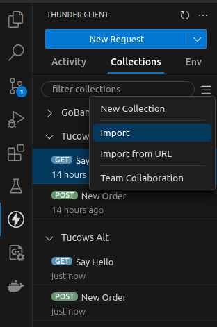

# Setup

## A brief note
I am doing this on my Ubuntu computer, so I will be writing these instructions assuming a unix-like environment. Any specific installation notes will be for Ubuntu. I expect this would work on MacOS as well, but am unable to check any specific changes. Fun enough, I have a new mini pc coming in the mail today so I will be able to really test from zero and insure I am not missing any requirements. 

## Requirements
- Go
  - https://go.dev/doc/install 
- Docker
  - https://docs.docker.com/engine/install/
- Docker Compose
  - https://docs.docker.com/compose/install/ 
- Make
  - `sudo apt-get -y install make` for ubuntu, `brew install make` on mac
- Some way to view individual docker container logs (I like the VS Code extension, linked below)
- Some way to make post and get requests to localhost (I like thunder client, linked below)

## Enhancements
These are tools that I used while developing this solution that will make it easier to interact with, but aren't necessarily mandatory. 

- VS Code - IDE I used in development. I also used the following extension, which can be installed by hitting `ctrl` + `p` and pasting in the install string (minus the backticks ).
  - [Markdown Preview Mermaid Support](https://marketplace.visualstudio.com/items?itemName=bierner.markdown-mermaid)
    - Enables mermaid diagrams to render in VS Code
    - install string: `ext install bierner.markdown-mermaid`
  - [ThunderClient](https://www.thunderclient.com/)
    - Postman, but for VS Code.
    - install string: `ext install rangav.vscode-thunder-client`
    - Note: I am using the free version 
  - [Markdown All in One](https://marketplace.visualstudio.com/items?itemName=yzhang.markdown-all-in-one)
    - Needed in order for the checkboxes in tickets.md to render properly
    - install string `ext install yzhang.markdown-all-in-one`
  - [Docker](https://marketplace.visualstudio.com/items?itemName=ms-azuretools.vscode-docker)
    - It's SO MUCH EASIER to view the logs one container at a time
    - install string `ext install ms-azuretools.vscode-docker`

## Instructions

As a head's up, this will use your machine's `localhost:8080` and `localhost:3000`. Ensure you are not currently relying on those. 

To start the service, run `docker compose up --build` and get yourself a cup of coffee because that's gonna take a bit.

You can run the pre-built rest calls by opening Thunder Client -> Collections -> Hamburger menu-> Import and selecting `thunder-collection_Tucows Alt.json`


To test, GET `localhost:3000` You should see logs in the `api` and `helloservice` containers

To create an  order, POST to `localhost:3000/orders` with a body that looks like this:
```json
{
  "customerId": 1,
  "productId": 2,
  "count": 3
}
```
To read the order, open your web browser and navigate to `localhost:8080` where you will find the Adminer instance we are using. Log in with the following info:
System: PostgreSQL
Server: db
Username: postgres
Password: SuperSecurePassword2
Database: postgres

From here you can see the tables that have been created and if you click into the Orders table you can see the order you just created. 